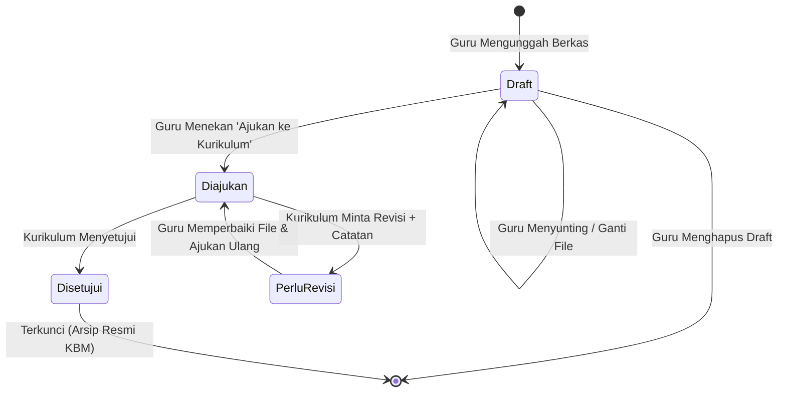

# 📋 Spesifikasi Fungsional: Sub-Task 02 — Manajemen Perangkat Mengajar (RPP / Modul Ajar)

- **Document ID / Slug:** `2026-08-17-1240-akademik-02-rpp`
- **Parent Master Spec:** [`.agents/specs/2026-08-17-1015-penyempurnaan-modul-akademik.md`](file:///d:/laragon/www/pintera-app/.agents/specs/2026-08-17-1015-penyempurnaan-modul-akademik.md)
- **Sub-Task Plan:** [`.agents/plans/2026-08-17-1240-akademik-02-rpp.md`](file:///d:/laragon/www/pintera-app/.agents/plans/2026-08-17-1240-akademik-02-rpp.md)
- **Tanggal Diterbitkan:** 17 Agustus 2026, 12:40 WIB
- **Target Domain:** `App\Domains\Akademik\` & `App\Http\Controllers\Admin\Akademik\`

---

## 1. Ringkasan & Tujuan Bisnis

Modul **Manajemen Perangkat Mengajar (RPP / Modul Ajar)** bertujuan mendigitalisasi dan menertibkan administrasi pengajaran guru di seluruh jenjang (KBIT, TKIT, SDIT, SMPIT). Modul ini menyediakan alur kerja yang terstruktur:
1. **Guru Pengampu** mengunggah berkas RPP / Modul Ajar (PDF/DOCX) terikat dengan tahun ajaran, semester, kelas, dan mata pelajaran (opsional untuk PAUD).
2. **Waka Kurikulum / Kepala Sekolah** meninjau berkas melalui inbox verifikasi, memberikan persetujuan (*Approved*) atau meminta perbaikan (*Revision Required*) disertai catatan koreksi.
3. Menjamin **Isolasi Multi-Tenancy** agar berkas ajar dan proses review terikat pada unit sekolah masing-masing.

---

## 2. Ruang Lingkup (*Scope*)

### A. In-Scope:
1. **Database Schema & Storage:**
   - Tabel `rpp` dengan tracking status, catatan revisi, riwayat verifikator, dan metadata file di storage privat/publik.
2. **Domain Architecture:**
   - Enum: `App\Domains\Akademik\Enums\StatusRpp` (`Draft`, `Diajukan`, `Disetujui`, `PerluRevisi`).
   - Model: `App\Domains\Akademik\Models\Rpp` dengan relasi ke `Guru`, `MataPelajaran`, `Kelas`, `Semester`, `TahunAjaran`, `Lembaga`, dan `User` (Verifikator).
   - DTO: `App\Domains\Akademik\DataTransferObjects\RppData`.
   - Actions: `CreateRppAction`, `UpdateRppAction`, `SubmitRppAction`, `VerifyRppAction`, `DeleteRppAction`.
3. **RBAC & Otorisasi:**
   - Hak akses upload/kelola: Guru Pengampu (pada data miliknya).
   - Hak akses verifikasi: Waka Kurikulum, Kepala Sekolah, Admin Akademik (`rpp.verify`).
4. **Antarmuka Pengguna (UI):**
   - **Tampilan Guru & Kurikulum Portal Scope (`resources/views/portals/lembaga/akademik/rpp/index.blade.php`):** Tab switcher dinamis *"Perangkat Ajar Saya"* (Guru) dan *"Inbox Verifikasi Kurikulum"* (Waka Kurikulum/Kepsek), modal upload berkas (Dropzone), tombol "Ajukan ke Kurikulum", kartu catatan revisi, serta native in-platform document lightbox viewer.
5. **Automated Testing:**
   - Test siklus hidup RPP (upload $\to$ submit $\to$ verify / revise $\to$ re-submit), validasi hak akses, dan tenant isolation (`tests/Feature/Akademik/RppWorkflowTest.php`).

### B. Out-of-Scope:
- Generator otomatis isi teks RPP menggunakan AI (direncanakan pada fase AI-Assistant masa depan).
- Penilaian asesmen siswa (ditangani pada Sub-Task 04 E-Rapor).

---

## 3. Spesifikasi Skema Database (`rpp`)

```sql
CREATE TABLE `rpp` (
  `id` BIGINT UNSIGNED NOT NULL AUTO_INCREMENT PRIMARY KEY,
  `yayasan_id` BIGINT UNSIGNED NOT NULL,
  `lembaga_id` BIGINT UNSIGNED NOT NULL,
  `guru_id` BIGINT UNSIGNED NOT NULL,
  `tahun_ajaran_id` BIGINT UNSIGNED NOT NULL,
  `semester_id` BIGINT UNSIGNED NOT NULL,
  `kelas_id` BIGINT UNSIGNED NOT NULL,
  `mata_pelajaran_id` BIGINT UNSIGNED NULL, -- Nullable untuk PAUD / Sentra Tematik
  `judul_topik` VARCHAR(255) NOT NULL,
  `alokasi_waktu` VARCHAR(100) NOT NULL, -- Contoh: "2 x 35 Menit" atau "3 Pertemuan"
  `pertemuan_ke` VARCHAR(50) NULL,
  `file_path` VARCHAR(255) NOT NULL,
  `file_name` VARCHAR(255) NOT NULL,
  `file_size_bytes` BIGINT UNSIGNED NOT NULL,
  `mime_type` VARCHAR(100) NOT NULL,
  `status` ENUM('draft', 'diajukan', 'disetujui', 'perlu_revisi') NOT NULL DEFAULT 'draft',
  `catatan_revisi` TEXT NULL,
  `verified_by_user_id` BIGINT UNSIGNED NULL,
  `verified_at` TIMESTAMP NULL,
  `created_at` TIMESTAMP NULL,
  `updated_at` TIMESTAMP NULL,
  CONSTRAINT `fk_rpp_yayasan` FOREIGN KEY (`yayasan_id`) REFERENCES `yayasan` (`id`) ON DELETE CASCADE,
  CONSTRAINT `fk_rpp_lembaga` FOREIGN KEY (`lembaga_id`) REFERENCES `lembaga` (`id`) ON DELETE CASCADE,
  CONSTRAINT `fk_rpp_guru` FOREIGN KEY (`guru_id`) REFERENCES `guru` (`id`) ON DELETE CASCADE,
  CONSTRAINT `fk_rpp_ta` FOREIGN KEY (`tahun_ajaran_id`) REFERENCES `tahun_ajaran` (`id`) ON DELETE CASCADE,
  CONSTRAINT `fk_rpp_semester` FOREIGN KEY (`semester_id`) REFERENCES `semester` (`id`) ON DELETE CASCADE,
  CONSTRAINT `fk_rpp_kelas` FOREIGN KEY (`kelas_id`) REFERENCES `kelas` (`id`) ON DELETE CASCADE,
  CONSTRAINT `fk_rpp_mapel` FOREIGN KEY (`mata_pelajaran_id`) REFERENCES `mata_pelajaran` (`id`) ON DELETE SET NULL,
  CONSTRAINT `fk_rpp_verifier` FOREIGN KEY (`verified_by_user_id`) REFERENCES `users` (`id`) ON DELETE SET NULL
);
```

---

## 4. Alur Siklus Status (*State-Machine*)



### Aturan Transisi:
1. **Status `Draft`:** Dapat disunting, diganti file, atau dihapus oleh Guru pembuat.
2. **Status `Diajukan`:** Terkunci dari pengubahan oleh Guru. Muncul di antarmuka verifikasi Kurikulum.
3. **Status `PerluRevisi`:** Terbuka kembali untuk diedit/diunggah ulang oleh Guru. Wajib menampilkan pesan `catatan_revisi` dari kurikulum.
4. **Status `Disetujui`:** Terkunci permanen. Menjadi dokumen acuan resmi KBM kelas.

---

## 5. Kriteria Penerimaan (*Acceptance Criteria*)

- [x] **AC-1 (Upload & Draft):** Guru dapat mengunggah berkas PDF/DOCX (maks 10MB) dengan melengkapi metadata kelas, mapel, topik, dan alokasi waktu. Data tersimpan dengan status `Draft`.
- [x] **AC-2 (Pengajuan):** Guru dapat mengajukan draf RPP, status berpindah menjadi `Diajukan`, dan file terkunci dari perubahan.
- [x] **AC-3 (Verifikasi Kurikulum - Setuju):** User dengan hak akses `rpp.verify` dapat menyetujui RPP, status berpindah menjadi `Disetujui`, mencatat `verified_by_user_id` dan `verified_at`.
- [x] **AC-4 (Verifikasi Kurikulum - Revisi):** Verifikator dapat meminta revisi dengan mengisi `catatan_revisi`. Status menjadi `PerluRevisi` dan catatan muncul di dashboard guru.
- [x] **AC-5 (Tenant & Role Scoping):** Guru dan Verifikator hanya dapat mengakses RPP pada lembaga/unit aktif mereka.
- [x] **AC-6 (PAUD Compatibility):** Upload RPP untuk jenjang PAUD dapat dilakukan tanpa memilih mata pelajaran (`mata_pelajaran_id` bernilai `null`).
