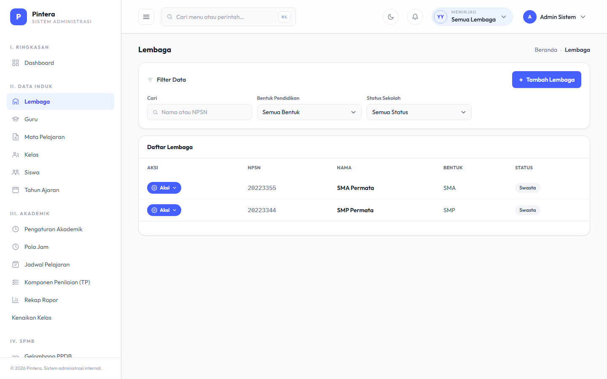
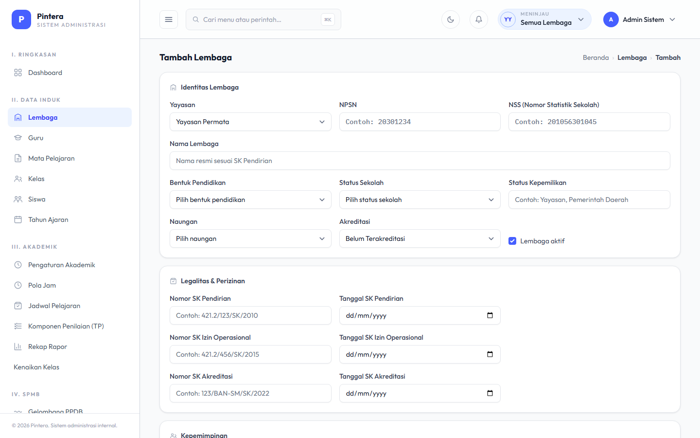
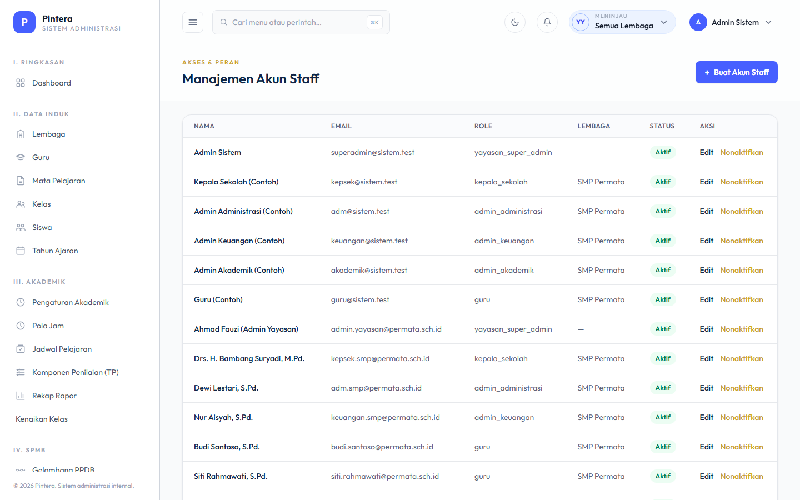
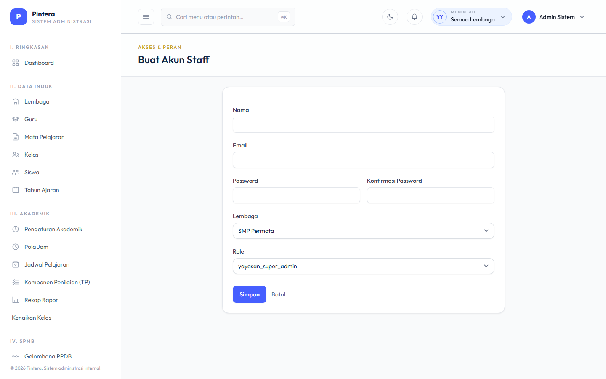

# Bab 0 — Setup Lembaga

## Untuk siapa

Admin Yayasan (`yayasan_super_admin`). Ini adalah langkah paling awal sebelum modul
akademik bisa dipakai sama sekali — semua bab berikutnya butuh minimal satu Lembaga aktif.

## Prasyarat

- Akun dengan role `yayasan_super_admin` sudah ada (dibuat oleh Super Admin sistem saat
  instalasi awal).
- Data Yayasan sudah diisi.

## Langkah-langkah

1. Login sebagai admin yayasan, lalu buka menu **Lembaga**.

   

2. Klik **Tambah Lembaga**. Isi data identitas lembaga: nama, jenjang (`bentuk_pendidikan`
   — TK/SD/SMP/SMA/SMK/dst), NPSN, NSS, alamat, kepala sekolah, dan data rekening.

   

3. Setelah Lembaga dibuat, buka menu **Pengguna** untuk membuat akun staf lembaga tersebut
   (Kepala Sekolah, Admin Akademik, Admin Administrasi, Admin Keuangan, Guru).

   

4. Saat membuat pengguna baru, pilih Lembaga yang bersangkutan dan pilih role yang sesuai
   perannya. Untuk yang akan mengelola data akademik (Kelas, Siswa, Jadwal, Presensi,
   Asesmen), pilih role **Admin Akademik**.

   

5. Jika yayasan menaungi lebih dari satu Lembaga, gunakan **pemilih lembaga (switcher)** di
   navbar untuk berpindah konteks — hampir semua halaman admin lembaga-scoped hanya
   menampilkan data lembaga yang sedang aktif dipilih.

## Kesalahan umum

- **Lupa memilih Lembaga aktif lewat switcher.** Sebagai admin yayasan, beberapa halaman
  pengaturan (mis. Pengaturan Akademik) mengharuskan satu Lembaga aktif dipilih dulu —
  kalau belum, halaman akan mengarahkan balik ke dashboard dengan pesan error, bukan
  crash.
- **Membuat pengguna tanpa memilih Lembaga.** Role seperti Admin Akademik dan Guru wajib
  terikat ke satu Lembaga (`lembaga_id`) — tanpa itu mereka tidak akan melihat data apa pun
  saat login.
