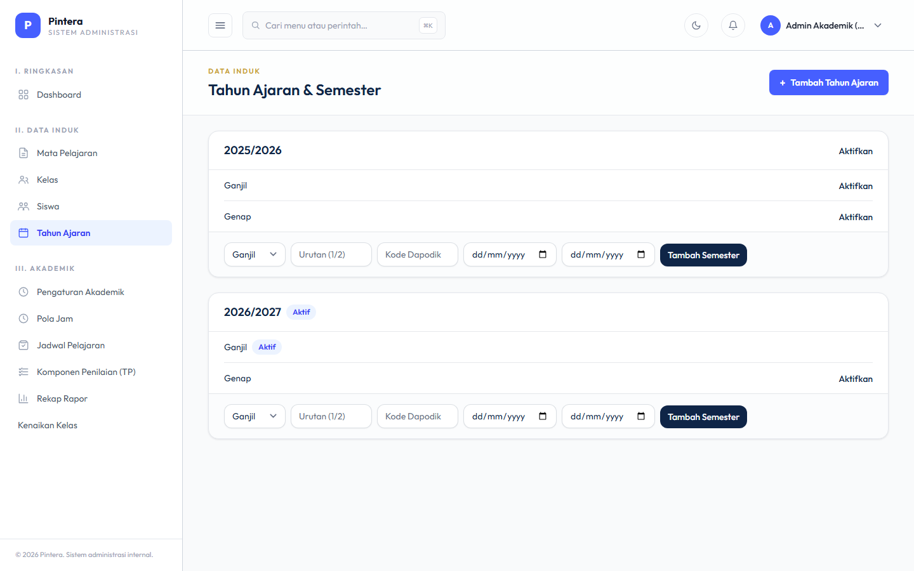
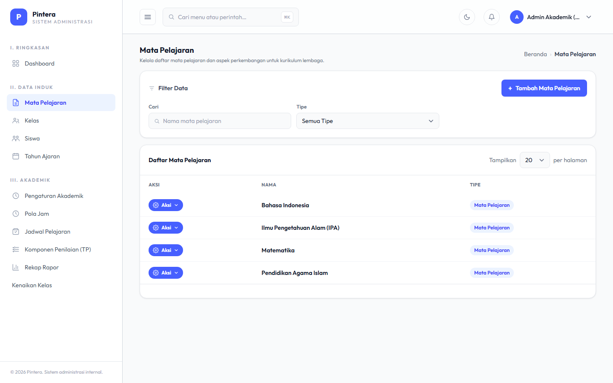
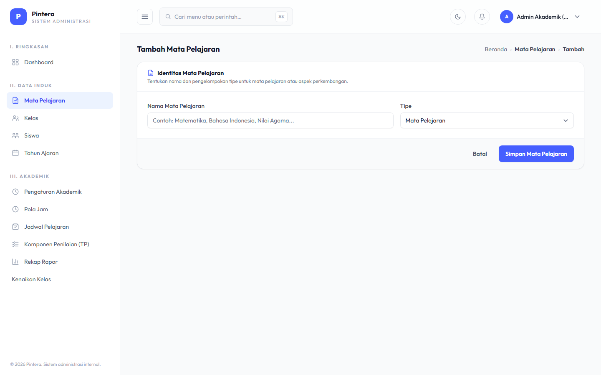
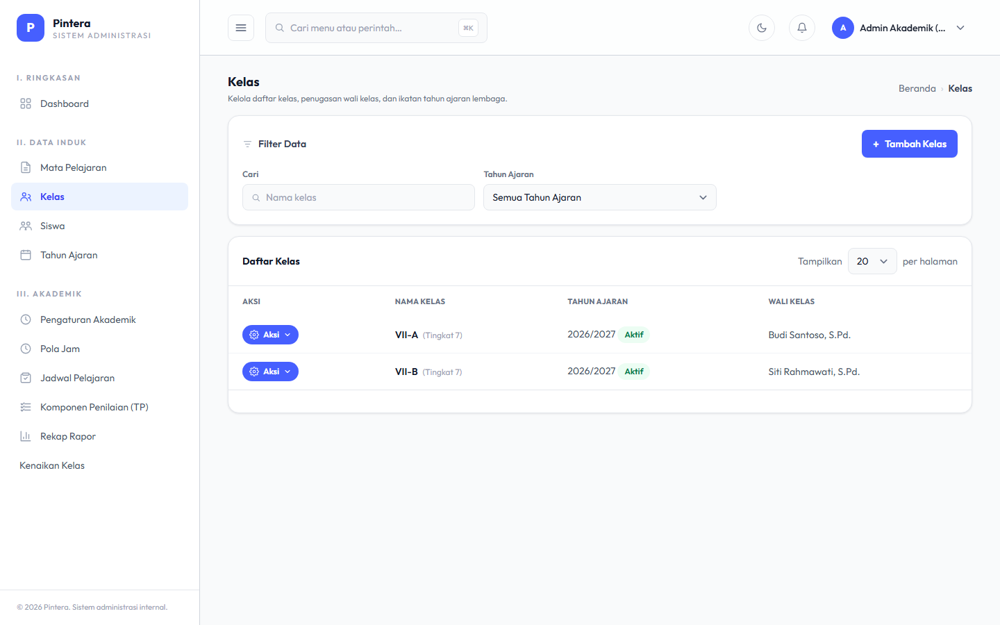
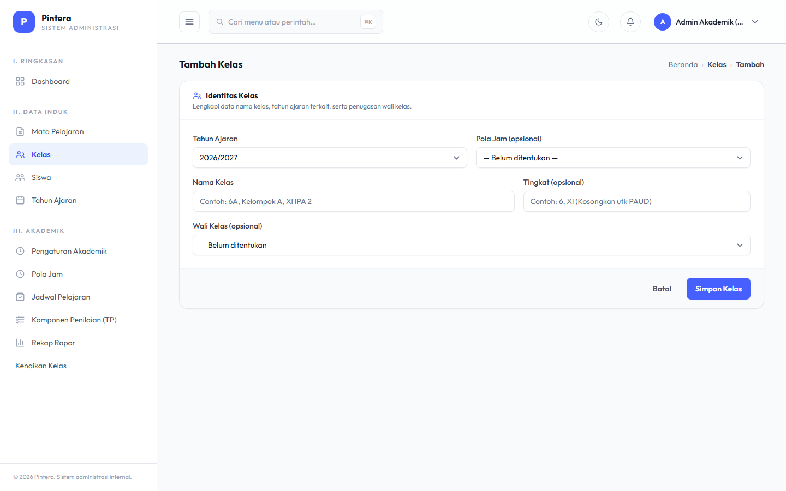
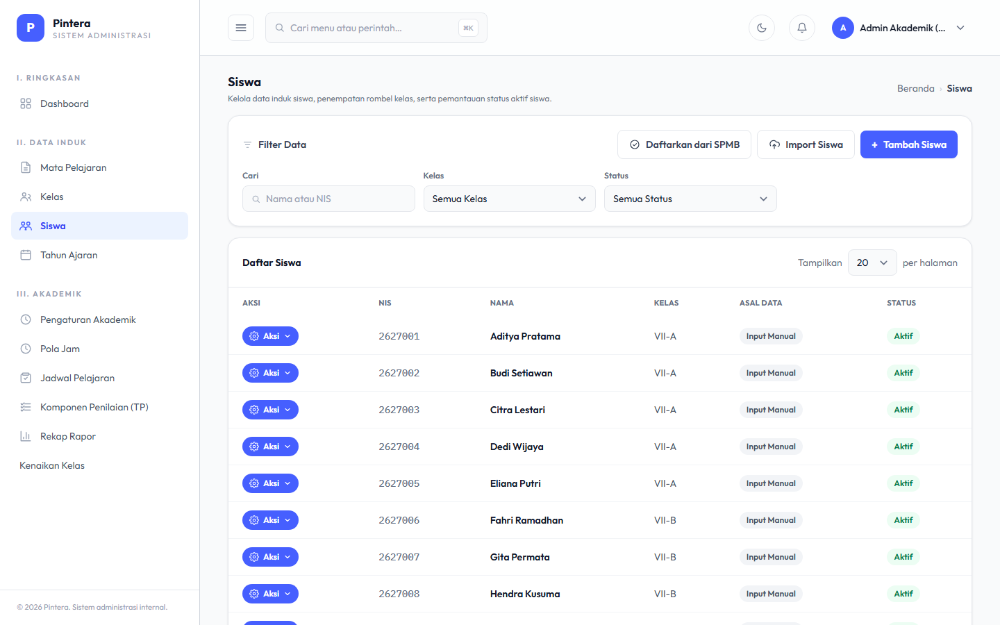
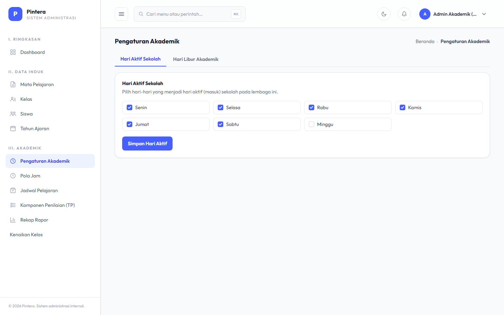

# Bab 1 — Data Master Akademik

## Untuk siapa

Admin Akademik (`admin_akademik`), per Lembaga.

## Prasyarat

- [Bab 0 — Setup Lembaga](00-setup-lembaga.md) sudah selesai: Lembaga dan akun Admin
  Akademik sudah ada.

## Langkah-langkah

### 1. Tahun Ajaran & Semester

Kelola dari satu halaman yang sama — buat Tahun Ajaran dulu (mis. "2026/2027"), lalu
tambahkan Semester Ganjil/Genap di dalamnya. Hanya satu Tahun Ajaran dan satu Semester
yang boleh berstatus aktif dalam satu waktu; mengaktifkan yang baru otomatis
menonaktifkan yang lama.

### 2. Mata Pelajaran

Mata Pelajaran bersifat per-Lembaga dan **tidak terikat tahun ajaran** — sekali dibuat,
otomatis tersedia untuk tahun ajaran berikutnya juga, tidak perlu dibuat ulang tiap tahun.

### 3. Kelas

Sama seperti Mata Pelajaran, Kelas juga per-Lembaga, tetapi setiap Kelas terikat pada satu
Tahun Ajaran tertentu (dipilih dari yang sudah dibuat di Langkah 1) — bukan persisten
lintas tahun ajaran seperti Mata Pelajaran. Saat membuat Kelas, tentukan tingkat,
wali kelas, dan Pola Jam yang dipakai (Pola Jam sendiri dibuat di
[Bab 2 — Penjadwalan](02-penjadwalan.md) — kalau belum ada, field ini boleh dikosongkan
dulu dan diisi belakangan).

### 4. Siswa

Ada 3 cara siswa masuk ke sistem: input manual satu-satu, import massal via Excel, atau
konversi otomatis dari pendaftar SPMB yang sudah diterima dan melakukan daftar ulang.
Halaman **Siswa** menampilkan hasil dari ketiganya dalam satu daftar yang sama.

### 5. Kalender Akademik & Hari Libur

Di halaman **Pengaturan Akademik**, atur hari aktif sekolah dalam seminggu (mis. Senin-Sabtu
aktif, Minggu libur) dan tambahkan hari libur/rentang libur khusus (libur nasional, libur
semester, dll). Ini menentukan hari mana yang dianggap "hari sekolah" oleh fitur Jadwal,
Presensi, dan Kenaikan Kelas.

## Kesalahan umum

- **Lupa mengaktifkan Tahun Ajaran/Semester yang baru dibuat.** Tahun Ajaran atau Semester
  yang belum diaktifkan tidak akan muncul sebagai pilihan default di halaman lain (mis.
  Kelas, Jadwal Pelajaran) — setelah membuat yang baru, klik **Aktifkan**.
- **Membuat Mata Pelajaran baru tiap tahun ajaran.** Tidak perlu — Mata Pelajaran memang
  didesain persisten lintas tahun ajaran. Yang berganti tiap tahun ajaran adalah Kelas
  (karena terikat Tahun Ajaran) dan isi Jadwal Pelajarannya (lihat Bab 2).
- **Menambah siswa manual padahal sudah pernah diimpor/dikonversi dari SPMB dengan NIS
  yang sama.** Sistem menolak NIS/NISN duplikat dalam satu Lembaga — kalau muncul error
  duplikat saat input manual, cek dulu apakah siswa itu sudah masuk lewat jalur SPMB atau
  import Excel.
