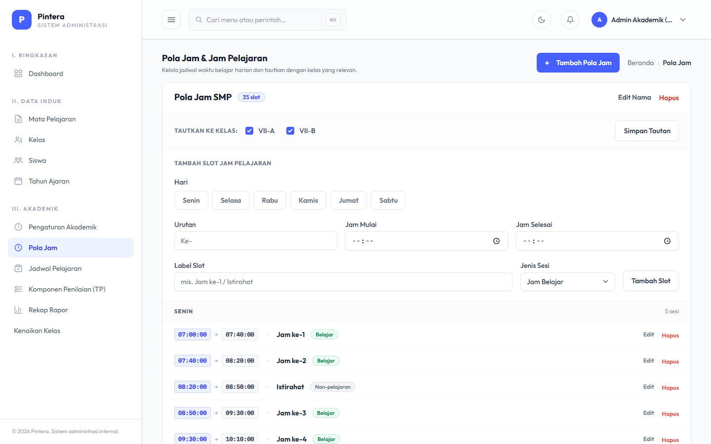
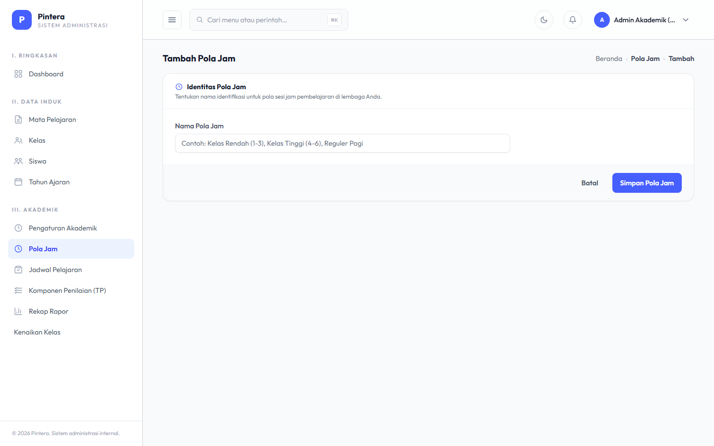
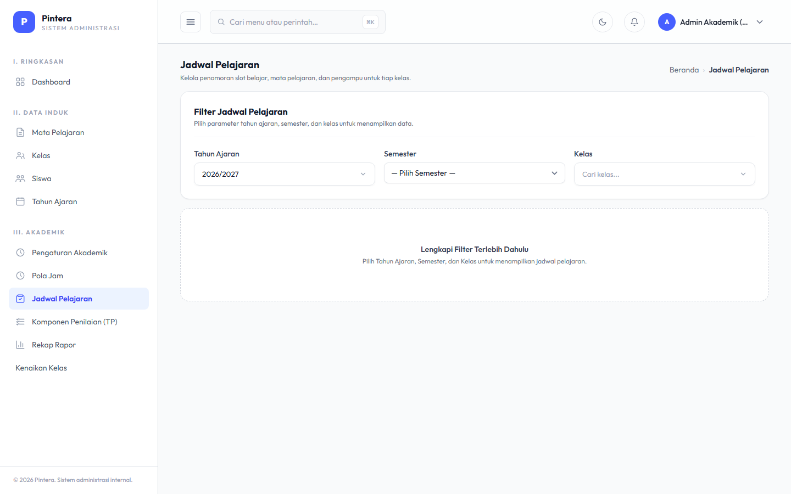
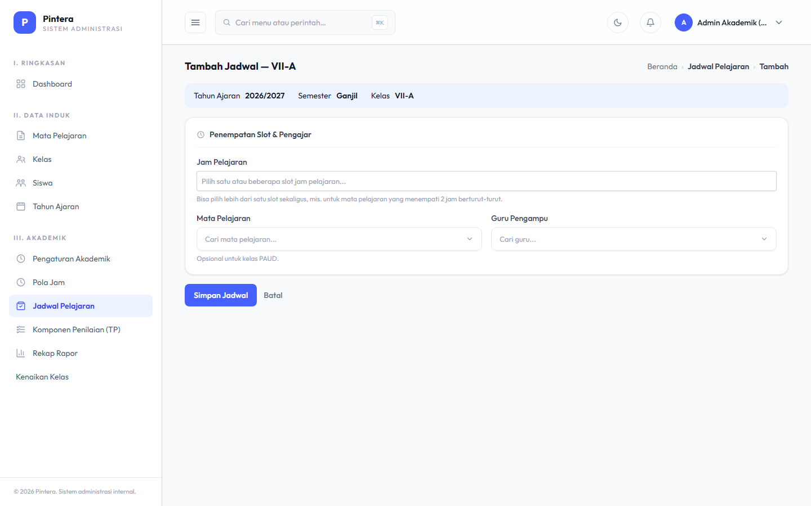

# Bab 2 — Penjadwalan

## Untuk siapa

Admin Akademik (`admin_akademik`), per Lembaga.

## Prasyarat

- [Bab 1 — Data Master](01-data-master.md) sudah selesai: Kelas, Mata Pelajaran, Guru, dan
  Semester aktif sudah ada.

## Langkah-langkah

### 1. Pola Jam & Jam Pelajaran

Pola Jam adalah template slot waktu (mis. Jam ke-1 07:00-07:40, Istirahat 08:20-08:50, dst)
yang bisa dipakai ulang oleh banyak Kelas. Buat Pola Jam dulu, lalu di halaman edit-nya
tambahkan Jam Pelajaran per hari (bisa dipilih beberapa hari sekaligus dalam satu submit).
Tandai slot istirahat/upacara sebagai "bukan jam pelajaran" supaya tidak muncul saat memilih
slot untuk Jadwal Pelajaran.

### 2. Kaitkan Pola Jam ke Kelas

Setiap Kelas harus terhubung ke satu Pola Jam (diisi saat membuat/mengedit Kelas di Bab 1,
atau lewat centang "Tautkan ke Kelas" dan tombol "Simpan Tautan" di halaman Pola Jam).

Perlu diingat: berbeda dengan Mata Pelajaran yang berlaku lintas tahun ajaran, data Kelas di
sistem ini melekat pada satu Tahun Ajaran tertentu — Kelas dari tahun ajaran sebelumnya tidak
otomatis terbawa ke tahun ajaran baru. Artinya setiap awal tahun ajaran, setelah Kelas baru
dibuat, tautan Pola Jam ke Kelas juga perlu dipasang ulang (Pola Jam-nya sendiri boleh dipakai
ulang, tidak perlu dibuat baru).

### 3. Jadwal Pelajaran

Jadwal Pelajaran menghubungkan satu Kelas + satu slot Jam Pelajaran + satu Mata Pelajaran +
satu Guru, untuk Semester yang sedang aktif. Diisi per slot per kelas.

## Kesalahan umum

- **Menghapus Pola Jam atau Jam Pelajaran yang masih dipakai.** Sistem akan menolak
  (menampilkan pesan error yang jelas) kalau Pola Jam masih dipakai Kelas, atau Jam
  Pelajaran masih punya Jadwal Pelajaran — hapus/pindahkan pemakainya dulu.
- **Guru terjadwal bentrok di dua kelas pada jam yang sama.** Sistem memvalidasi ini saat
  menyimpan Jadwal — kalau muncul error bentrok jadwal, cek jadwal guru yang sama di kelas
  lain pada hari & jam yang sama.
- **Filter tanpa memilih Semester dulu.** Halaman Jadwal Pelajaran menampilkan data spesifik
  per Semester — pastikan Semester aktif sudah benar sebelum menambah jadwal, supaya tidak
  salah tempel ke semester yang keliru.
- **Lupa menautkan ulang Pola Jam ke Kelas di tahun ajaran baru.** Karena Kelas tidak
  persisten lintas tahun ajaran, Kelas baru di tahun ajaran berikutnya belum otomatis
  terhubung ke Pola Jam manapun — tanpa tautan ini, halaman Jadwal Pelajaran tidak akan punya
  slot Jam Pelajaran untuk dipilih.
