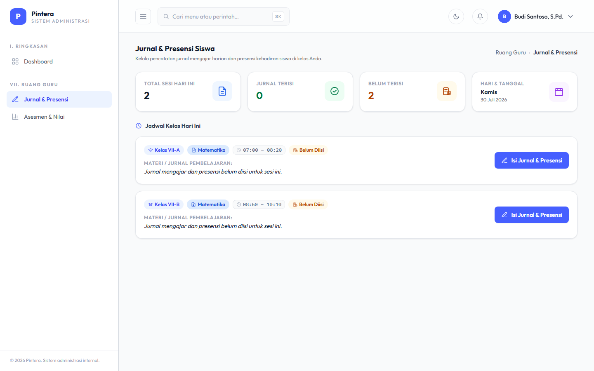
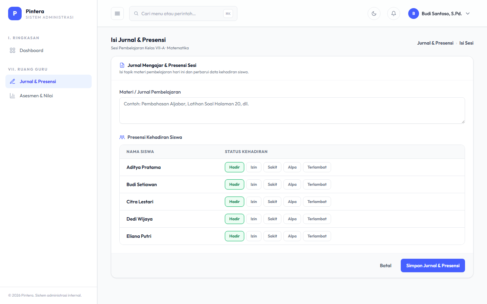

# Bab 3 — Presensi & Jurnal

## Untuk siapa

Guru (role `guru`), dari halaman "Ruang Guru".

## Prasyarat

- [Bab 2 — Penjadwalan](02-penjadwalan.md) sudah selesai: guru yang bersangkutan sudah
  punya Jadwal Pelajaran untuk hari ini.

## Langkah-langkah

1. Login sebagai guru, buka **Ruang Guru → Jurnal & Presensi**. Halaman ini menampilkan
   sesi mengajar hari ini, digabung otomatis dari slot Jam Pelajaran yang berurutan untuk
   guru dan mata pelajaran yang sama (mis. Jam ke-1 dan ke-2 Matematika di kelas yang sama
   digabung jadi satu sesi, bukan dua sesi terpisah).

   

2. Klik **Isi Jurnal & Presensi** pada salah satu sesi untuk membuka detailnya. Di sini guru
   mengisi:
   - **Presensi** per siswa: Hadir / Izin / Sakit / Alpa / Terlambat.
   - **Jurnal**: materi yang diajarkan pada sesi tersebut.

   

3. Simpan. Data ini menjadi dasar rekap kehadiran siswa dan riwayat pengajaran per kelas.

## Kesalahan umum

- **Sesi tidak muncul di daftar.** Sesi hanya muncul kalau memang ada Jadwal Pelajaran
  untuk guru tsb pada hari itu (lihat Bab 2) dan hari itu bukan hari libur (lihat Bab 1,
  Kalender Akademik). Kalau kosong padahal seharusnya ada jadwal, cek dulu dua hal itu.
- **Mengisi presensi dua kali untuk siswa yang sama pada sesi yang sama.** Sistem
  menimpa (bukan menduplikasi) entri presensi yang sudah ada untuk kombinasi sesi+siswa
  yang sama — aman untuk dibuka & diedit ulang kalau ada salah input.
