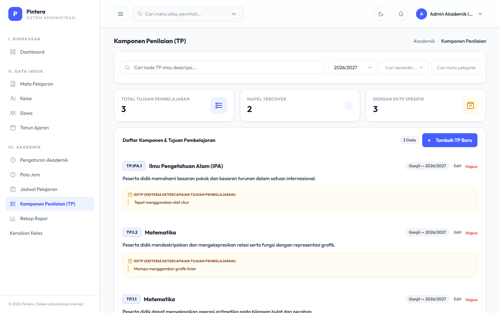
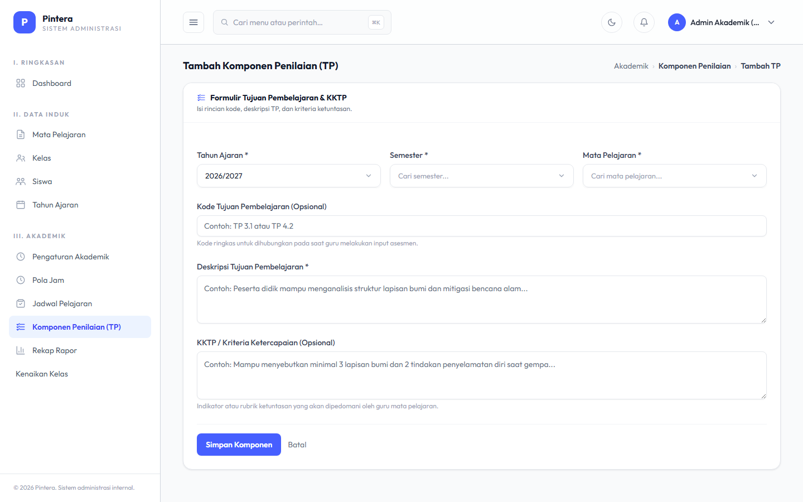
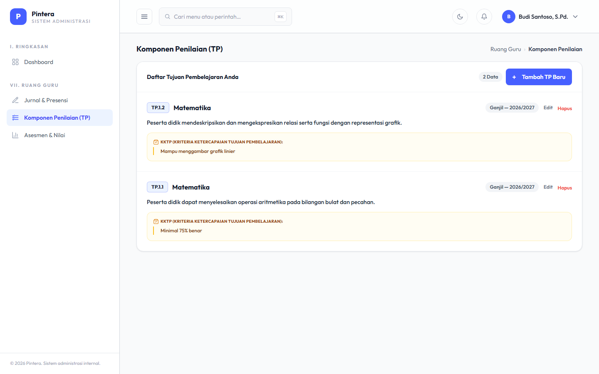
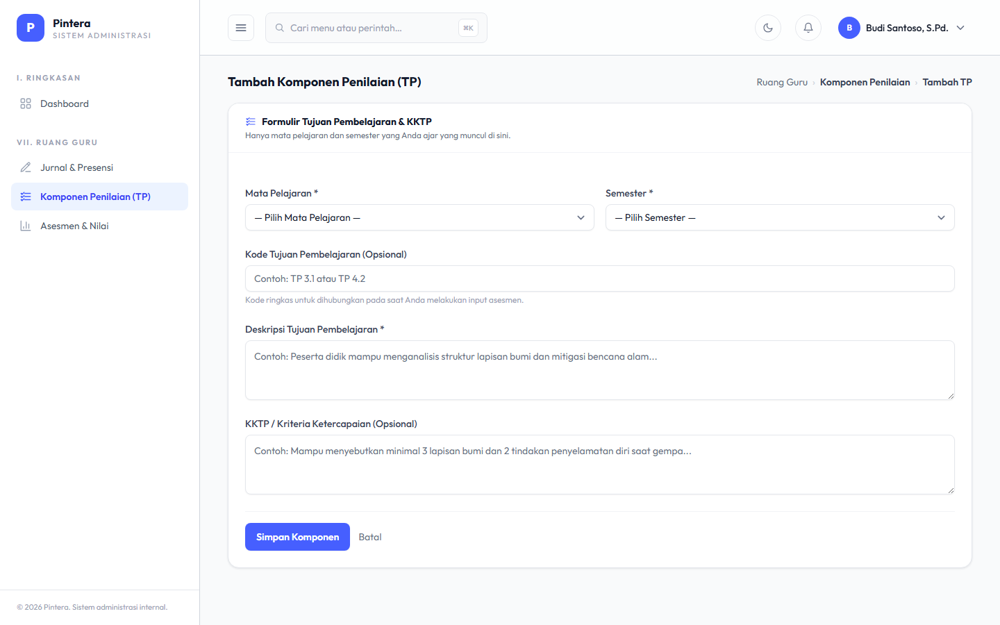
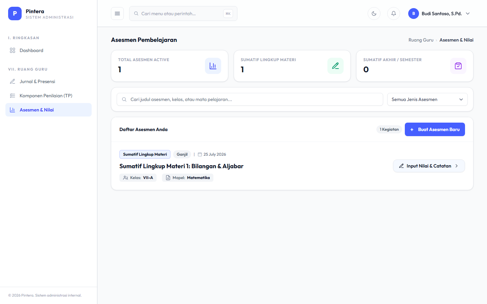
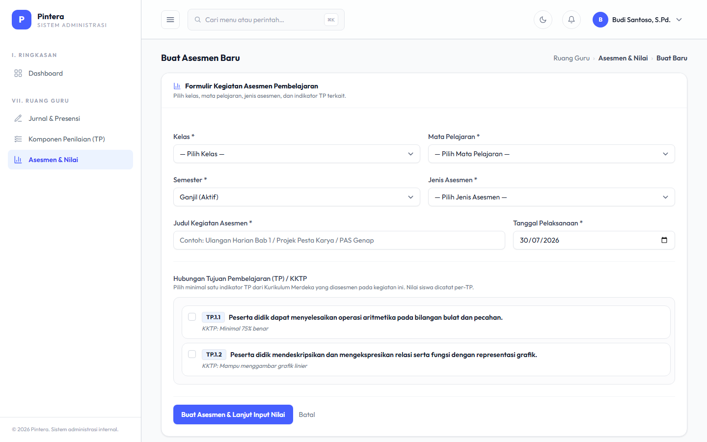

# Bab 4 — Asesmen & Nilai

## Untuk siapa

**Admin Akademik** dan **Guru** sama-sama bisa menyiapkan Komponen Penilaian (Tujuan
Pembelajaran) — Admin Akademik untuk mata pelajaran apa pun di lembaganya, Guru hanya untuk
mata pelajaran yang benar-benar dia ajar (sesuai Jadwal Pelajaran). Setelah itu **Guru**
membuat Asesmen dan mengisi nilai berdasarkan komponen tersebut.

## Prasyarat

- [Bab 1 — Data Master](01-data-master.md): Mata Pelajaran dan Semester aktif sudah ada.
- [Bab 2 — Penjadwalan](02-penjadwalan.md): guru sudah punya Jadwal Pelajaran ke kelas yang
  akan dinilai — ini juga yang menentukan mata pelajaran mana yang boleh dia buatkan
  Komponen Penilaiannya sendiri.

## Langkah-langkah

### 1. Komponen Penilaian (Admin Akademik atau Guru)

Komponen Penilaian (Tujuan Pembelajaran/TP, mengikuti Kurikulum Merdeka) didefinisikan per
Mata Pelajaran + Semester. Ini adalah acuan penilaian yang nanti dipilih guru saat membuat
Asesmen. Karena guru mata pelajaran biasanya paling tahu TP-nya sendiri, tidak perlu
menunggu Admin Akademik — guru bisa langsung membuatnya sendiri untuk mata pelajaran yang
dia ajar, tanpa perlu persetujuan.

**Sisi Admin Akademik** (bisa untuk mata pelajaran apa pun):

**Sisi Guru** (dibatasi hanya mata pelajaran yang dia ajar):

Komponen Penilaian yang sudah dipakai oleh Asesmen atau sudah ada nilainya terkunci
sebagian (Mata Pelajaran & Semester-nya tidak bisa diganti lagi) — untuk menjaga histori
nilai tetap konsisten. Ini berlaku sama baik dibuat oleh Admin Akademik maupun Guru.

### 2. Guru — Asesmen & Input Nilai

Dari **Ruang Guru → Asesmen**, guru membuat Asesmen baru: pilih Kelas, Mata Pelajaran,
jenis asesmen (Sumatif Lingkup Materi / Sumatif Akhir Semester / Sumatif Akhir Jenjang),
dan satu atau lebih Komponen Penilaian yang diukur — termasuk Komponen Penilaian yang tadi
dia buat sendiri di Langkah 1.

Setelah Asesmen dibuat, buka halaman detailnya untuk mengisi nilai tiap siswa di kelas
tersebut, per Komponen Penilaian yang dipilih, lengkap dengan catatan opsional.

## Kesalahan umum

- **Guru tidak melihat Komponen Penilaian yang diharapkan saat membuat Asesmen.** Cek
  apakah Komponen Penilaian (dibuat Admin Akademik maupun guru sendiri) sudah ada untuk
  kombinasi Mata Pelajaran + Semester yang sama dengan Asesmen yang sedang dibuat — Komponen
  Penilaian mata pelajaran atau semester lain tidak akan muncul.
- **Guru tidak bisa membuat/mengedit Komponen Penilaian untuk mata pelajaran tertentu.**
  Guru hanya bisa kelola Komponen Penilaian untuk mata pelajaran yang ada di Jadwal
  Pelajarannya sendiri (Bab 2) — kalau belum punya Jadwal Pelajaran untuk mapel itu, minta
  Admin Akademik menambahkannya dulu.
- **Mengubah Mata Pelajaran/Semester pada Komponen Penilaian yang sudah dipakai.** Field ini
  sengaja dikunci begitu ada Asesmen atau nilai yang mereferensikannya — buat Komponen
  Penilaian baru kalau butuh acuan yang berbeda, jangan ubah yang lama. Di sisi Guru, Mata
  Pelajaran dan Semester memang tidak pernah bisa diubah sama sekali (bukan cuma saat
  terpakai) — buat TP baru kalau salah pilih.
