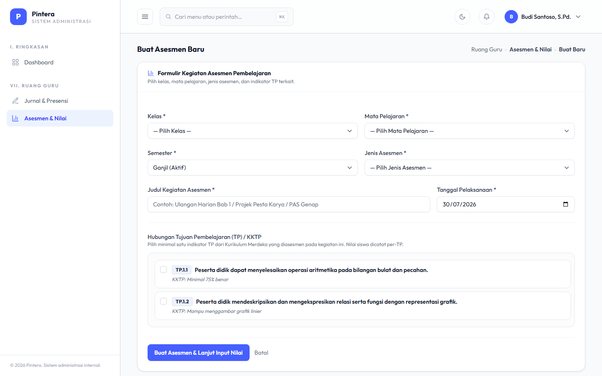

# Bab 4 — Asesmen & Nilai

## Untuk siapa

Dua peran berurutan: **Admin Akademik** menyiapkan Komponen Penilaian (Tujuan Pembelajaran),
lalu **Guru** membuat Asesmen dan mengisi nilai berdasarkan komponen tersebut.

## Prasyarat

- [Bab 1 — Data Master](01-data-master.md): Mata Pelajaran dan Semester aktif sudah ada.
- [Bab 2 — Penjadwalan](02-penjadwalan.md): guru sudah punya Jadwal Pelajaran ke kelas yang
  akan dinilai.

## Langkah-langkah

### 1. Admin Akademik — Komponen Penilaian

Komponen Penilaian (Tujuan Pembelajaran/TP, mengikuti Kurikulum Merdeka) didefinisikan per
Mata Pelajaran + Semester. Ini adalah acuan penilaian yang nanti dipilih guru saat membuat
Asesmen.

Komponen Penilaian yang sudah dipakai oleh Asesmen atau sudah ada nilainya terkunci
sebagian (Mata Pelajaran & Semester-nya tidak bisa diganti lagi) — untuk menjaga histori
nilai tetap konsisten.

### 2. Guru — Asesmen & Input Nilai

Dari **Ruang Guru → Asesmen**, guru membuat Asesmen baru: pilih Kelas, Mata Pelajaran,
jenis asesmen (Sumatif Lingkup Materi / Sumatif Akhir Semester / Sumatif Akhir Jenjang),
dan satu atau lebih Komponen Penilaian yang diukur.

Setelah Asesmen dibuat, buka halaman detailnya untuk mengisi nilai tiap siswa di kelas
tersebut, per Komponen Penilaian yang dipilih, lengkap dengan catatan opsional.

## Kesalahan umum

- **Guru tidak melihat Komponen Penilaian yang diharapkan saat membuat Asesmen.** Cek
  apakah Admin Akademik sudah membuat Komponen Penilaian untuk kombinasi Mata Pelajaran +
  Semester yang sama dengan Asesmen yang sedang dibuat — Komponen Penilaian mata pelajaran
  atau semester lain tidak akan muncul.
- **Mengubah Mata Pelajaran/Semester pada Komponen Penilaian yang sudah dipakai.** Field ini
  sengaja dikunci begitu ada Asesmen atau nilai yang mereferensikannya — buat Komponen
  Penilaian baru kalau butuh acuan yang berbeda, jangan ubah yang lama.
