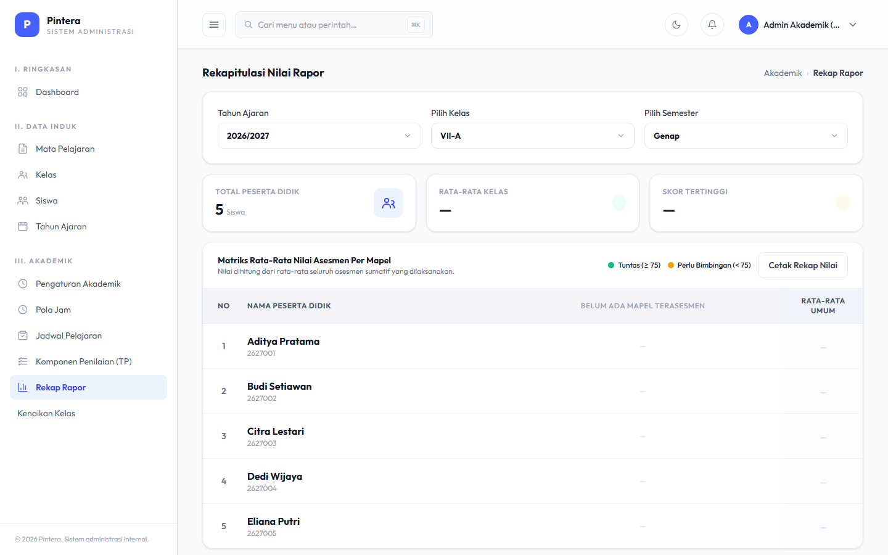
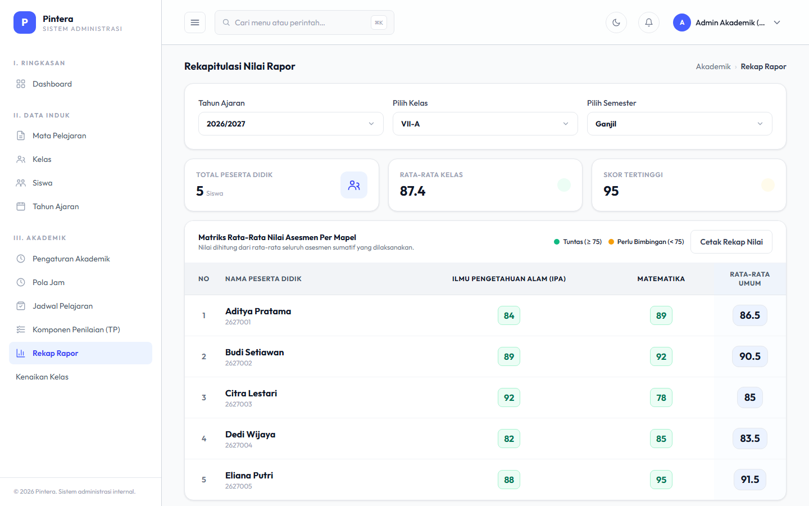

# Bab 5 — Rekap Rapor

## Untuk siapa

Admin Akademik, dan Kepala Sekolah (lihat-saja) untuk meninjau hasil.

## Prasyarat

- [Bab 4 — Asesmen & Nilai](04-asesmen-nilai.md) sudah selesai: minimal satu Asesmen dengan
  nilai terisi untuk kelas yang ingin direkap.

## Langkah-langkah

1. Buka menu **Rekap Rapor**. Pilih **Tahun Ajaran** terlebih dahulu — pilihan Kelas dan
   Semester akan otomatis menyesuaikan (menyaring hanya yang benar-benar milik tahun ajaran
   tsb, supaya tidak salah pilih kombinasi lintas tahun).

   

2. Setelah Kelas dan Semester dipilih, tabel rekap nilai per siswa per Mata Pelajaran
   tampil langsung tanpa reload halaman. Nilai di bawah ambang tuntas (default 75, bisa
   diubah lewat konfigurasi sistem) ditandai berbeda dari yang tuntas.

   

3. Klik **Cetak Rekap Nilai** untuk mengunduh rekap dalam bentuk siap cetak (PDF).

## Kesalahan umum

- **Memilih Kelas dulu sebelum Tahun Ajaran.** Selalu pilih Tahun Ajaran terlebih dahulu —
  ini pernah jadi sumber bug (kombinasi Kelas/Semester dari tahun ajaran berbeda ikut
  tercampur) sebelum filter dibuat bertingkat seperti sekarang; urutan pengisian di
  halaman ini bukan sekadar preferensi tampilan.
- **Rekap kosong padahal nilai sudah diisi guru.** Pastikan nilai diisi untuk Semester yang
  sama dengan yang dipilih di filter rekap — nilai dari semester lain sengaja tidak ikut
  tercampur.
