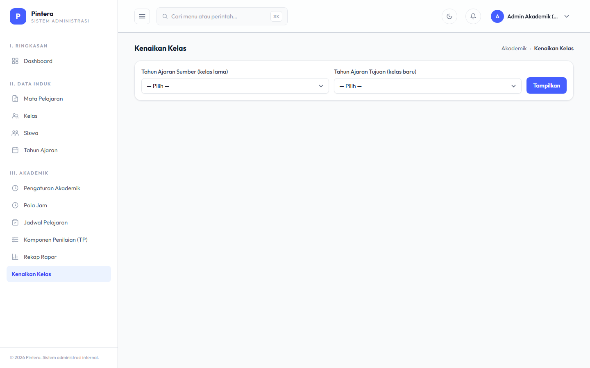
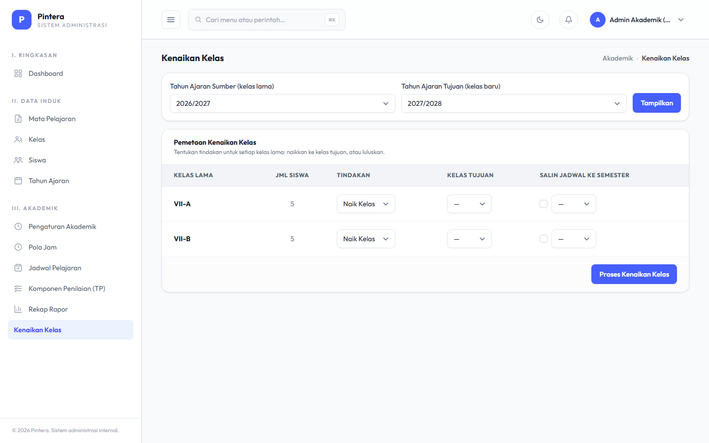

# Bab 6 — Kenaikan Kelas

## Untuk siapa

Admin Akademik (Kepala Sekolah juga punya akses yang sama). Ini bab penutup siklus tahun
ajaran — dikerjakan sekali di akhir tahun ajaran, biasanya setelah Rekap Rapor (Bab 5)
selesai dan sudah diverifikasi.

## Prasyarat

- [Bab 5 — Rekap Rapor](05-rekap-rapor.md) sudah dicek dan dianggap final untuk semester
  akhir tahun ajaran yang berjalan.
- Tahun Ajaran baru untuk tahun berikutnya sudah dibuat (lihat Bab 1) — Kenaikan Kelas
  memindahkan siswa KE tahun ajaran baru itu, bukan membuatkannya secara otomatis.

## Langkah-langkah

1. Buka menu **Kenaikan Kelas**. Pilih **Tahun Ajaran Sumber** (tempat kelas lama berada)
   dan **Tahun Ajaran Tujuan** (tempat kelas baru berada), lalu klik **Tampilkan**.

   

2. Tabel **Pemetaan Kenaikan Kelas** muncul, satu baris per Kelas di tahun ajaran sumber.
   Untuk setiap baris, pilih **Tindakan** (Naik Kelas atau Lulus). Kalau Naik Kelas, pilih
   **Kelas Tujuan** — pilihan yang muncul otomatis dibatasi hanya ke Kelas milik Tahun
   Ajaran Tujuan yang dipilih di langkah 1, supaya tidak salah pilih kelas dari tahun yang
   sama dengan kelas asal.

   

3. (Opsional) Centang **Salin Jadwal ke Semester** dan pilih semester tujuan kalau ingin
   struktur Jadwal Pelajaran kelas lama (mata pelajaran, guru, jam) disalin otomatis ke
   kelas & semester baru — jadi Admin Akademik tidak perlu menyusun ulang jadwal dari nol
   di Bab 2.

4. Klik **Proses Kenaikan Kelas**. Seluruh siswa di kelas asal dipindahkan sekaligus (bukan
   satu per satu) ke kelas tujuan yang dipilih; siswa yang ditandai Lulus dikeluarkan dari
   kelas manapun.

## Kesalahan umum

- **Proses ini tidak bisa dibatalkan begitu selesai.** Pastikan Rekap Rapor semester
  terakhir sudah benar-benar final sebelum menjalankan Kenaikan Kelas — data presensi dan
  nilai semester lama tetap tersimpan (tidak terhapus), tapi siswa akan langsung terasosiasi
  ke kelas & tahun ajaran baru begitu diproses.
- **Tahun Ajaran Tujuan belum dipilih.** Kalau hanya Tahun Ajaran Sumber yang dipilih,
  tabel Pemetaan Kenaikan Kelas belum ditampilkan — sistem menampilkan pesan pengingat
  untuk memilih Tahun Ajaran Tujuan juga sebelum melanjutkan.
- **Kelas Tujuan tidak muncul di daftar.** Itu tandanya belum ada Kelas yang dibuat untuk
  Tahun Ajaran Tujuan yang dipilih — buat dulu Kelas barunya (Bab 1) di tahun ajaran
  tersebut.
