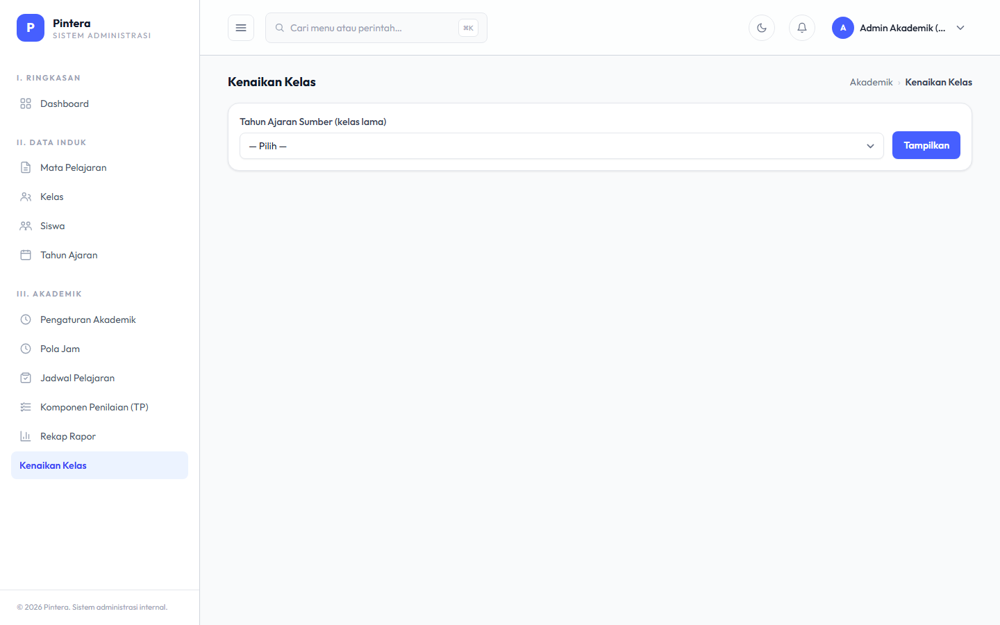

# Bab 6 — Kenaikan Kelas

## Untuk siapa

Admin Akademik. Ini bab penutup siklus tahun ajaran — dikerjakan sekali di akhir tahun
ajaran, biasanya setelah Rekap Rapor (Bab 5) selesai dan sudah diverifikasi.

## Prasyarat

- [Bab 5 — Rekap Rapor](05-rekap-rapor.md) sudah dicek dan dianggap final untuk semester
  akhir tahun ajaran yang berjalan.
- Tahun Ajaran baru untuk tahun berikutnya sudah dibuat (lihat Bab 1) — Kenaikan Kelas
  memindahkan siswa KE tahun ajaran baru itu, bukan membuatkannya secara otomatis.

## Langkah-langkah

1. Buka menu **Kenaikan Kelas**. Untuk setiap Kelas asal, pilih Kelas tujuan di tahun ajaran
   baru (naik tingkat), atau tandai sebagai **Lulus** untuk siswa tingkat akhir.

   

2. Konfirmasi dan proses. Seluruh siswa di kelas asal dipindahkan sekaligus (bukan satu per
   satu) ke kelas tujuan yang dipilih.

## Kesalahan umum

- **Proses ini tidak bisa dibatalkan begitu selesai.** Pastikan Rekap Rapor semester
  terakhir sudah benar-benar final sebelum menjalankan Kenaikan Kelas — data presensi dan
  nilai semester lama tetap tersimpan (tidak terhapus), tapi siswa akan langsung terasosiasi
  ke kelas & tahun ajaran baru begitu diproses.
- **Kelas tujuan berasal dari tahun ajaran yang salah.** Kelas tujuan yang ditawarkan harus
  berasal dari Tahun Ajaran yang sudah dibuat untuk periode berikutnya — kalau daftar
  pilihan kosong atau tidak sesuai ekspektasi, cek dulu apakah Tahun Ajaran barunya sudah
  ada (Bab 1).
