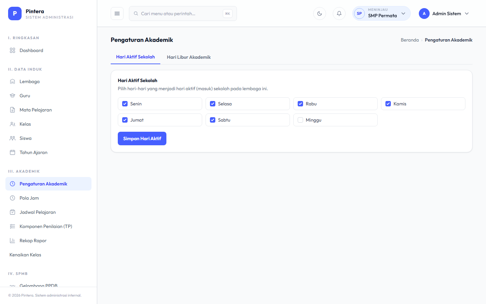

# Lampiran — Kalender Nasional & Pengaturan Lintas Lembaga

## Untuk siapa

Admin Yayasan (`yayasan_super_admin`).

## Prasyarat

- [Bab 0 — Setup Lembaga](00-setup-lembaga.md) selesai, minimal satu Lembaga aktif dipilih
  lewat switcher.

## Langkah-langkah

Peran Admin Yayasan di modul akademik ini sempit — bukan pengguna harian data akademik
(itu domain Admin Akademik per Lembaga, lihat Bab 1-6). Yang jadi bagiannya:

1. **Kalender Akademik Nasional.** Dari halaman **Pengaturan Akademik** (dengan satu
   Lembaga aktif terpilih via switcher), Admin Yayasan bisa menambahkan entri kalender yang
   berlaku untuk **semua Lembaga** di bawah yayasan sekaligus (mis. libur nasional yang
   sama untuk seluruh sekolah), berbeda dari entri kalender biasa yang hanya berlaku untuk
   satu Lembaga.

   

2. Entri nasional ini otomatis muncul di kalender setiap Lembaga tanpa perlu diinput ulang
   oleh masing-masing Admin Akademik.

## Kesalahan umum

- **Mengira halaman ini bisa diakses tanpa memilih Lembaga aktif dulu.** Meskipun entri
  nasional berlaku lintas-lembaga, halamannya sendiri tetap butuh satu Lembaga aktif
  terpilih (untuk menampilkan konteks kalender gabungan nasional + lembaga tsb) — pilih
  lewat switcher navbar dulu kalau halaman mengarahkan balik ke dashboard.
